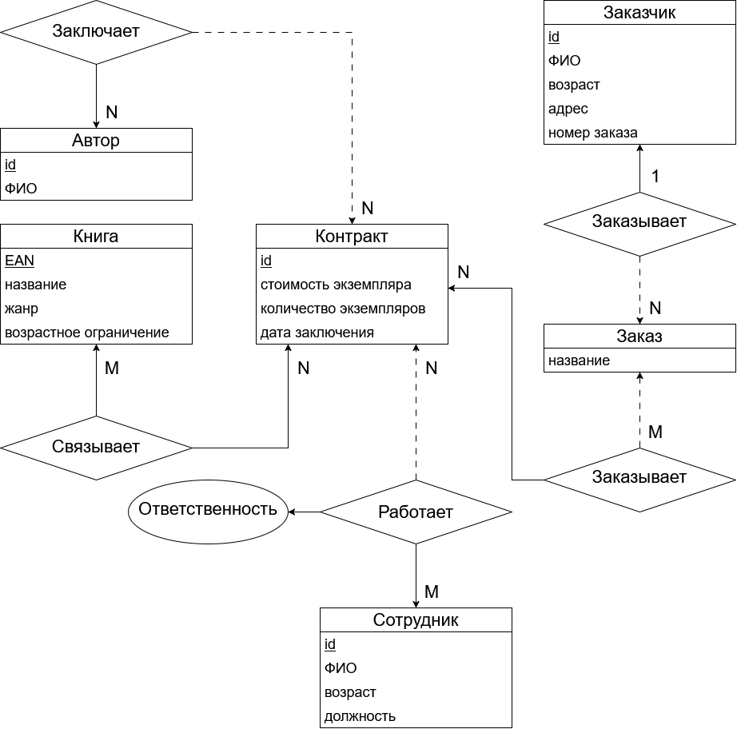

## Содержание
* [practice-1 er-модель и основные понятия (05.09.2026)](#practice-1-er-модель-и-основные-понятия)

# practice-1 er-модель и основные понятия
05.09.2026  
er-модель - реляционная модель над предметной областью.  
pk-ключ - определенный, уникальный и неизбыточный атрибут.  
Альтернатиный ключ - ключ, который может стать pk-ключем.  
Связь  - ассоциирование двух или более сущностей. Каждая связь характеризуется именем, степенью типом и обязательностью. Обязательность - сплошная линия, необязательность - пунктирная линия.  
Связь является обязательной, если в данной связи должен участвовать каждый экземпляр сущности, факультативной — если не каждый экземпляр сущности должен участвовать в данной связи. При этом связь может быть обязательной с одной стороны и факультативной с другой стороны.  
Типы связей:
* Связь 1:1. Каждый экземпляр сущности А связан с неболее чем одним экземпляром сущности В и наоборот.  
* Связь 1:M. Каждый экземпляр сущности А  связан со многими экземплярами сущности В, но каждый экземпляр сущности В связан с неболее чем одним экземпляром сущности А.  
* Связь M:N. Несколько экземпляров сущности А связаны с несколькими экземплярами сущности В и наоборот.  

markdown 

