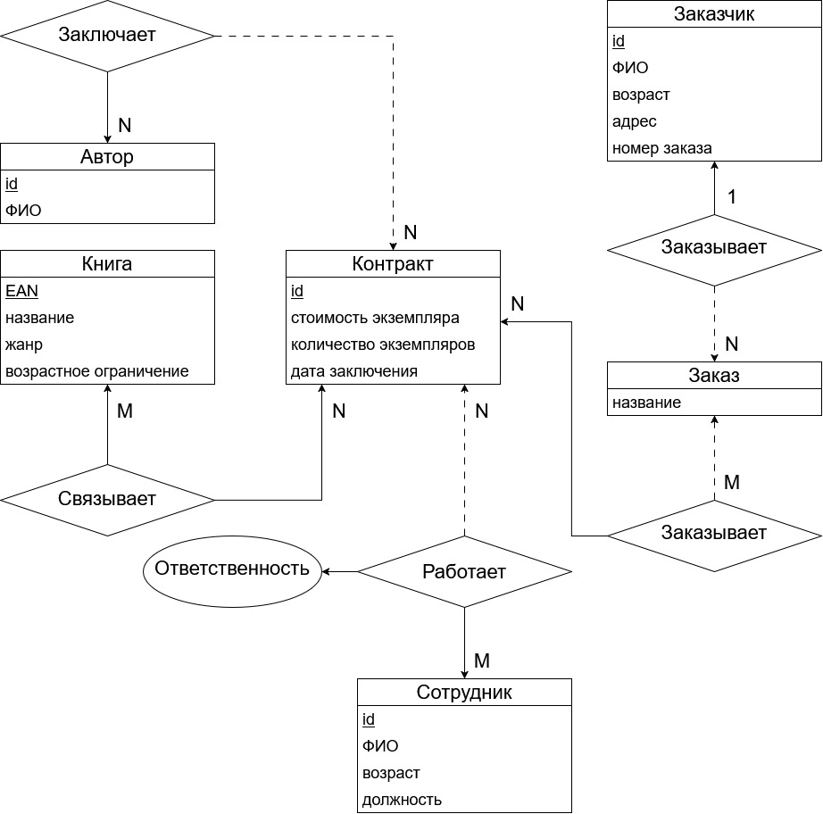
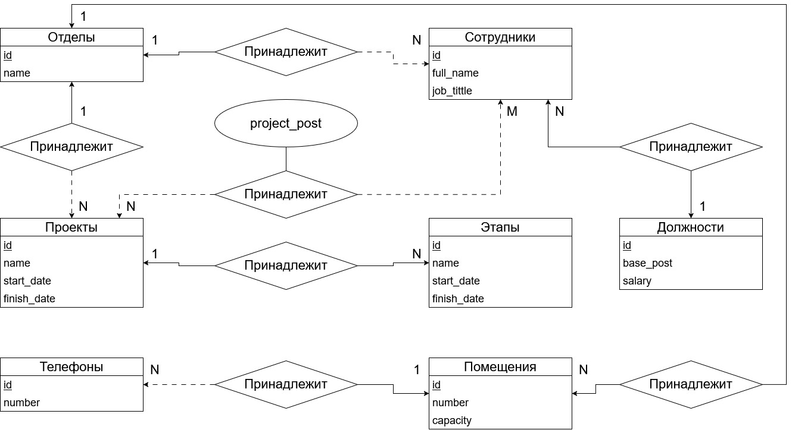
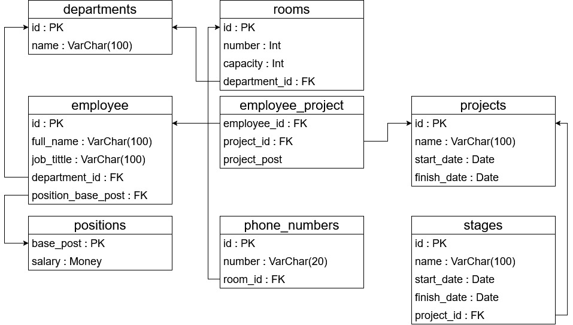

## Содержание
* [practice-1 er-модель и основные понятия (05.09.2026)](#practice-1-er-модель-и-основные-понятия)
* [practice-2 реляционная модель (12.09.2026)](#practice-2-реляционная-модель)
* [practice-3 SQL DDL (19.09.2026)](#practice-3-SQL-DDL)

# practice-1 er-модель и основные понятия
05.09.2026  
er-модель - реляционная модель над предметной областью.  
pk-ключ - определенный, уникальный и неизбыточный атрибут.  
Альтернатиный ключ - ключ, который может стать pk-ключем.  
Связь  - ассоциирование двух или более сущностей. Каждая связь характеризуется именем, степенью типом и обязательностью. Обязательность - сплошная линия, необязательность - пунктирная линия.  
Связь является обязательной, если в данной связи должен участвовать каждый экземпляр сущности, факультативной — если не каждый экземпляр сущности должен участвовать в данной связи. При этом связь может быть обязательной с одной стороны и факультативной с другой стороны.  
Типы связей:
* Связь 1:1. Каждый экземпляр сущности А связан с неболее чем одним экземпляром сущности В и наоборот.  
* Связь 1:M. Каждый экземпляр сущности А  связан со многими экземплярами сущности В, но каждый экземпляр сущности В связан с неболее чем одним экземпляром сущности А.  
* Связь M:N. Несколько экземпляров сущности А связаны с несколькими экземплярами сущности В и наоборот.  

  

# practice-2 реляционная модель
12.09.2026  
Пример создания er-модели и e-модели на её основе.
  
  

# practice-3 SQL DDL
19.09.2026  
DDL (Data Definition Language):  
Создание сущностей, их pk и fk. Работа с типами, уникальностью и ограничениями.
```sql
-- Создание таблицы
CREATE TABLE table_name (
  column_1 datatype constraint,
  ...
);  

-- Удаление таблицы со всеми данными
DROP TABLE table_name;

-- Пример синтаксиса
CREATE TABLE example
(
    -- Одинарный pk
	id INT NOT NULL PRIMARY KEY,
    -- Составной pk
    PRIMARY KEY (first_name, last_name)

	first_name NVARCHAR(255) NOT NULL,
	last_name NVARCHAR(255) NOT NULL,

    -- Дефолтные значения DEFAULT
    region NVARCHAR(255) NOT NULL DEFAULT('Yaroslavl region')
    -- Ограничения CHECK
    city NVARCHAR(255) NOT NULL CHECK(CITY in ('New York', 'Boston'))
);

CREATE TABLE groups
(
	id INT NOT NULL PRIMARY KEY,
	[name] NVARCHAR(255) NOT NULL UNIQUE,
);

CREATE TABLE students
(
    -- Автоинкрементация IDENTITY(начало, шаг)
	id INT IDENTITY(1, 1) PRIMARY KEY,
	first_name NVARCHAR(255) NOT NULL,
	last_name NVARCHAR(255) NOT NULL,

    -- Создание fk
    group_id INT,
    FOREIGN KEY (group_id) REFERENCES groups(id)

    -- Задаём каскад, при удалении/обновлении
    ON DELETE <ПРАВИЛО>
    ON UPDATE <ПРАВИЛО>

/*
Правила:
1) CASCADE: автоматическое удаление/обновление связанных строк
2) SET NULL: устанавливает значение внешнего ключа в NULL
3) SET DEFAULT: устанавливает значение внешнего ключа в значение по умолчанию, заданное при создании таблицы
4) RESTRICT / NO ACTION: блокируют удаление или изменение, выдаёт ошибку
*/
);

-- Оформление ограничений через CONSTRAINT
/*
Как задавать названия для CONSTRAINT
pk_...: ограничения для PK
fk_...: ограничения для FK
uq_...: ограничения для UNIQUE
ck_...: ограничения для CKECK
df_...: ограничения для DEFAULT
*/
CREATE TABLE groups
(
	id INT IDENTITY(1, 1) CONSTRAINT pk_groups PRIMARY KEY,
	name NVARCHAR(255) NOT NULL
);

CREATE TABLE students
(
	id INT IDENTITY(1, 1) CONSTRAINT pk_groups PRIMARY KEY,
	first_name NVARCHAR(255) NOT NULL,
	second_name NVARCHAR(255) NOT NULL,
	email NVARCHAR(255) NULL CONSTRAINT uq_students_email UNIQUE,
	city VARCHAR(255) NOT NULL
		CONSTRAINT df_students_city DEFAULT('Yaroslavl')
		CONSTRAINT ck_students_city CHECK(city in ('Yaroslavl', 'Moscow')),
	group_id INT NULL
		CONSTRAINT fk_students_group_id
			FOREIGN KEY (group_id) REFERENCES groups(id)
			ON DELETE CASCADE
			ON UPDATE CASCADE
);

-- Изменение структуры таблицы
-- Добавление столбца
ALTER TABLE students ADD phone_number NVARCHAR(20);
-- Удаление таблицы
ALTER TABLE students DROP COLUMN email;
-- Изменение типа столбца
ALTER TABLE students ALTER COLUMN second_name NVARCHAR(300);
```

# practice-4 SQL DML(Data Manipulation Language) DCL(Data Controll Language) TCL(Transactions Controll Language)
